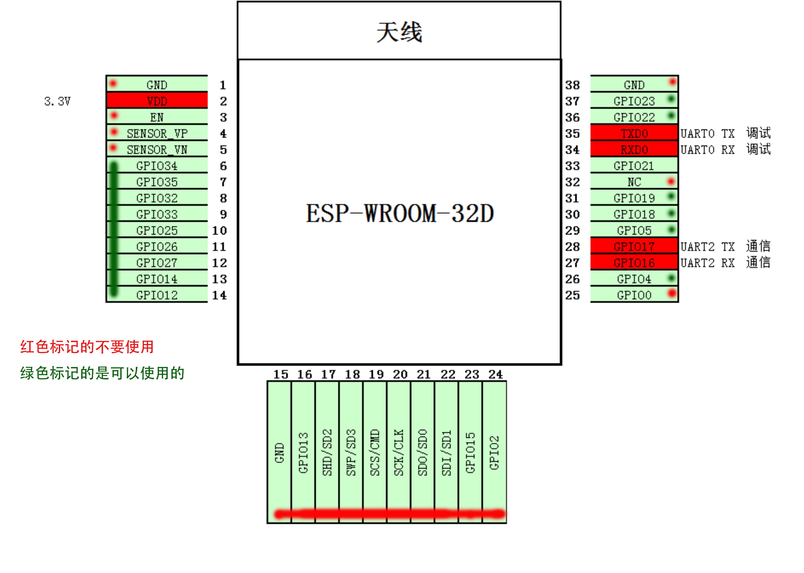

# Smart Slow Life - Docs
智慧慢生活项目文档

* 禁止存放机密文档，包含保密协议相关的文档；

## Miot-esp32-sdk二次开发项目备注
* 搭建环境请参考小米二次开发的指南；
* Miot-esp32-sdk用到了esp-idf的releasev3.1版本，所以想着sdk，工具链，esp环境设置都用v3.1版本，[文档地址](https://docs.espressif.com/_/downloads/esp-idf/en/release-v3.1/pdf/)；
* esp32工具链v3.1版本对应的osx文件[点击这里下载](https://dl.espressif.com/dl/xtensa-esp32-elf-osx-1.22.0-80-g6c4433a-5.2.0.tar.gz)
* 


## 模板固件本地下载
1. 根据小米文档，二次开发，并打包
2. 执行以下命令，将bin文件烧录到设备中：根据下面的默认分区表，可知如何将bin文件烧录到哪个分区，其中0x8000用于烧录分区表，
	* 烧录完整镜像，是将生成的4M.bin烧录到0x0地址即可
	
	```
	esptool.py --port /dev/cu.SLAB_USBtoUART -b 115200 write_flash 0x0 /Users/fick/Documents/github/MIoT-ESP32-SDK/debug/builds/ruos.flowerpot.rssp01-1/bins/iflash_ruos.flowerpot.rssp01-1_4MB.bin
	```
	
	* 只烧录app,往1区烧录
	
	```
	esptool.py --port /dev/cu.SLAB_USBtoUART -b 115200 write_flash 0x10000 /Users/fick/Documents/github/MIoT-ESP32-SDK/debug/builds/ruos.flowerpot.rssp01-1/bins/upd_ruos.flowerpot.rssp01-1.bin
	```
	
	* 烧录phy_init_data
	
	```
	--port /dev/cu.SLAB_USBtoUART -b 115200 write_flash 0xf000 /Users/fick/Documents/github/MIoT-ESP32-SDK/debug/builds/ruos.flowerpot.rssp01-1/bins/phy_init_data.bin
	```
	
	* 烧录分区表，如果分区表被破坏，可以将此bin文件烧录到0x8000，恢复分区表
	
	```
	--port /dev/cu.SLAB_USBtoUART -b 115200 write_flash 0x8000 /Users/fick/Documents/github/MIoT-ESP32-SDK/debug/builds/ruos.flowerpot.rssp01-1/bins/xiaomi_partitions_4M.bin
	```
	
## 默认分区详解

|序号|lable|作用|类型|st|偏移|长度|
|---|---|---|---|---|---|---|
|0| nvs |WiFi data| 01 | 02 | 00009000 | 00004000 |
|1| otadata |OTA data| 01 | 00 | 0000d000 | 00002000 |
|2| phy_init |RF data| 01 | 01 | 0000f000 | 00001000 |
|3| miio_fw1 |OTA app| 00 | 10 | 00010000 | 00160000 |
|4| miio_fw2 |OTA app| 00 | 11 | 00170000 | 00160000 |
|5| test |test app | 00 | 20 | 002d0000 | 00013000 |
|6| mimcu |Unknown data| 01 | fd | 002e3000 | 00100000 |
|7| coredump |Unknown data| 01 | 03 | 003e3000 | 00010000 |
|8| minvs |Unknown data| 01 | fe | 003f8000 | 00004000 |
	
## esptool命令
esptool用的是源码安装方式，需要到~/esp/esptool目录下执行脚本；未添加环境变量； 

## 小米wifi-ble模组引脚



* 共38个引脚； 
* 17-22引脚用于内部flash，不用于其他用途； 
* 25引脚（GPIO0）启动瞬间不要拉低，否则会进入 download 模式；
* 10引脚（GPIO25） 工厂测试管脚，悬空或者上拉处理，建议不使用；
* 5个stapping管脚如下，尽量不使用：
	* 14(GPIO12):MTDI
	* 25:GPIO0
	* 24:GPIO2
	* 23(GPIO15):MTDO
	* 29:GPIO5
* 6:GPIO34,7:GPIO35，是仅可作为输入的IO；
* RTC_GPIO:可在低功耗、尝试睡眠模式下使用的IO；